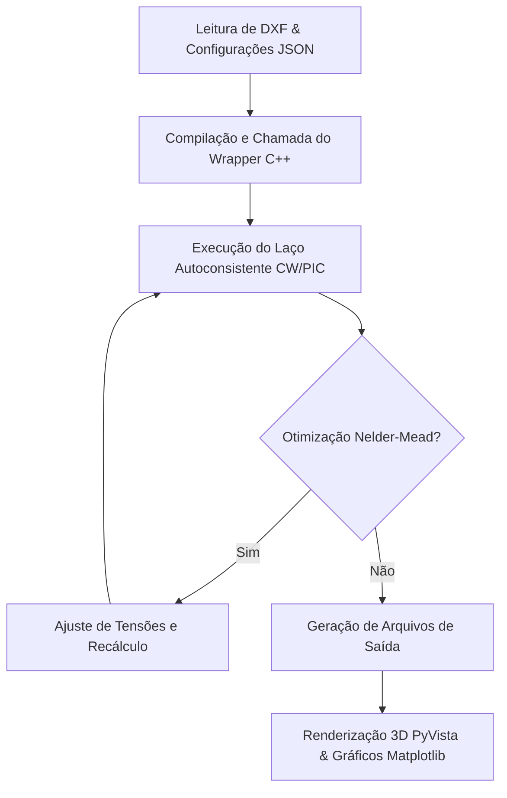
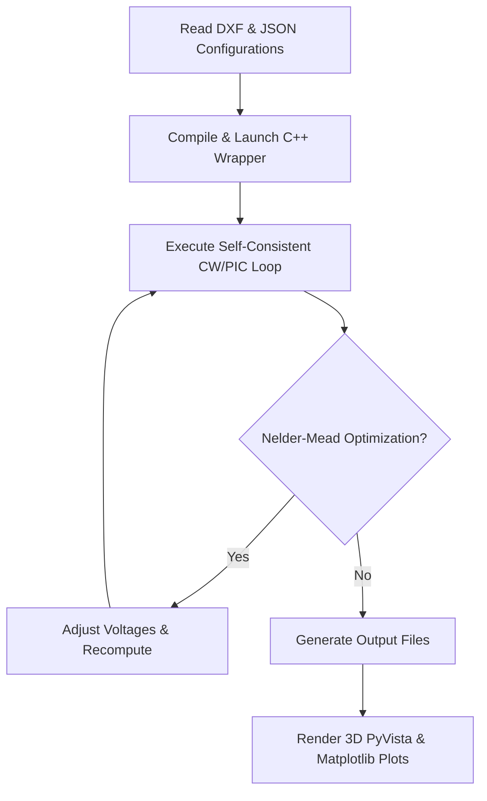

# IBSimion v2.0.1.e3l - Manual de Operação Científica / Scientific Operations Manual

---

## 🇧🇷 Parte 1: Português (PT)

### 1. Introdução Física e Modelagem Numérica
O **IBSimion** realiza a integração numérica de trajetórias de partículas carregadas sob a influência de campos eletrostáticos e magnetostáticos tridimensionais, utilizando a biblioteca **IBSimu**.

- **Regime Contínuo (CW - Continuous Wave)**: O simulador resolve a equação de Poisson de forma autoconsistente com a carga espacial gerada pelas trajetórias. O laço autoconsistente (Space Charge Loops) funciona através de iterações sucessivas:
  1. Calcula-se o potencial de vácuo com base nas condições de contorno (Dirichlet/Neumann).
  2. Traçam-se as trajetórias das partículas no campo elétrico resultante.
  3. Mapeia-se a densidade de carga espacial gerada pelas trajetórias na grade de cálculo.
  4. Recalcula-se a equação de Poisson incluindo a densidade de carga espacial obtida.
  5. Repete-se o processo até que a variação espacial do potencial ou da densidade de carga convirja abaixo do limite tolerado.
- **Regime Transiente (PIC - Particle-in-Cell)**: Utilizado para feixes pulsados ou transientes. As macropartículas são agrupadas em pacotes resolvidos no tempo ($\Delta t$). A densidade de carga espacial e a equação de Poisson são atualizadas a cada passo temporal na grade discreta, permitindo observar efeitos dinâmicos de carga espacial.

---

### 2. Otimização Numérica via Nelder-Mead Simplex
Para o ajuste fino de componentes ópticos (como lentes de foco de Einzel), o simulador incorpora o algoritmo clássico de otimização não-linear local **Nelder-Mead (Simplex)** de malha fechada.
- **Objetivo**: Minimizar a divergência geométrica ou a emitância transversal do feixe de partículas.
- **Mecanismo**: O otimizador ajusta iterativamente um conjunto de parâmetros de controle (ex: potenciais elétricos aplicados a eletrodos específicos). A função objetivo avalia a transmitância e os parâmetros Twiss no plano de diagnóstico final após cada execução completa do wrapper C++.
- *Nota: Este recurso realiza puramente varreduras e minimização matemática de funções multivariadas locais, livre de algoritmos heurísticos probabilísticos ou redes neurais.*

---

### 3. Guia de Manipulação Prática

#### A. Entrada de Dados (Geometria e Campo)
1. **Malha de Eletrodos (CAD)**: O usuário define o perfil dos eletrodos em arquivos DXF 2D utilizando camadas (layers) distintas. O simulador lê as camadas selecionadas e realiza a extrusão planar ou rotação cilíndrica de revolução em torno do eixo de simetria para gerar os contornos 3D (condições de contorno Dirichlet).
2. **Campo Magnético Importado**: Para solenoides ou magnetos, ativa-se o campo magnético definindo o caminho de uma tabela bidimensional de coordenadas axiais e radiais (`sol.txt`). O resolvedor projeta o campo cilíndrico axial ($B_z$) e radial ($B_r$) no espaço cartesiano 3D transladando as coordenadas para o eixo de propagação Z (longitudinal), aplicando interpolação bilinear contínua.

#### B. Configuração do Cenário
As variáveis da simulação são ajustadas diretamente no arquivo JSON de projeto (`config_scenario.json`):
- `"geometries"`: Lista de objetos CAD importados contendo voltagens (`"voltage"`), escalas de conversão (`"scale"`, ex: `0.001` para mm), offsets de translação e tipo de mapeamento (`"mapping"`).
- `"beams"`: Define as espécies carregadas com seu número de macropartículas (`"particulas"`), emitância térmica inicial (`"emittance"`), corrente do feixe (`"corrente"`) e energia cinética inicial (`"energy"`, em eV).
- `"iterations"`: Define a quantidade limite de iterações do laço autoconsistente CW.

#### C. Execução e Monitoramento
- O resolvedor nativo é acionado em background pelo pipeline automatizado ou pela interface gráfica.
- O terminal exibe mensagens de status padronizadas com a marcação `[STATUS]` detalhando cada etapa da simulação (Carregamento de malhas, montagem da equação de Poisson, iterações de trajetórias e cálculo de convergência).

#### D. Análise de Resultados
- **Visualizador 3D**: Trajetórias de partículas e contornos geométricos dos eletrodos são renderizados interativamente via PyVista. O usuário pode fatiar a visualização ativando planos de corte ortogonais para auditar o potencial interno.
- **Gráficos 2D**: O Matplotlib plota curvas de convergência de perda (Nelder-Mead), histogramas de dispersão de tempo de voo (TOF) e emitância RMS ao longo do eixo de propagação Z.

---
---

## 🇬🇧 Part 2: English (EN)

### 1. Physical Introduction & Numerical Modeling
**IBSimion** performs numerical integration of charged particle trajectories under the influence of three-dimensional electrostatic and magnetostatic fields using the **IBSimu** physics library.

- **Continuous Wave (CW) Regime**: The solver computes the Poisson equation self-consistently with the space charge generated by particle trajectories. The Self-Consistent Space Charge Loop iterates as follows:
  1. Computes the vacuum potential based on boundary conditions (Dirichlet/Neumann).
  2. Tracks particle trajectories through the resulting electric field.
  3. Maps the space-charge density generated by the trajectories onto the computational grid.
  4. Recomputes the Poisson equation, incorporating the updated space-charge density.
  5. Repeats this cycle until the spatial variation of the potential or charge density converges below the designated threshold.
- **Transient (PIC - Particle-in-Cell) Regime**: Used for pulsed or time-dependent beams. Macroparticles are tracked in time-resolved packets ($\Delta t$). Space charge density and the Poisson equation are updated at every time step on the discrete grid, enabling observation of transient space-charge effects.

---

### 2. Numerical Optimization via Nelder-Mead Simplex
For fine-tuning optical components (such as Einzel focusing lenses), the simulator incorporates the classical, closed-loop **Nelder-Mead (Simplex)** non-linear local optimization algorithm.
- **Objective**: Minimize beam divergence or transverse root-mean-square (RMS) emittance.
- **Mechanism**: The optimizer iteratively adjusts a set of control parameters (e.g., electrical potentials applied to specific electrodes). The objective function evaluates transmission and Twiss parameters at the final diagnostic plane after each complete C++ backend wrapper execution.
- *Note: This feature relies purely on multivariate mathematical sweeps and local minimization of functions, completely free of probabilistic heuristic models or neural networks.*

---

### 3. Practical Operations Guide

#### A. Data Inputs (Geometry & Fields)
1. **Electrode Meshes (CAD)**: Users define electrode profiles in 2D DXF files using distinct CAD layers. The simulator parses the selected layers and performs planar extrusion or cylindrical rotation to generate the 3D boundary conditions (Dirichlet).
2. **Imported Magnetic Field**: For solenoids or magnets, the magnetic field is enabled by referencing a 2D lookup table of axial and radial coordinates (`sol.txt`). The solver projects the cylindrical axial ($B_z$) and radial ($B_r$) fields into 3D Cartesian coordinates, translating them onto the Z-axis of beam propagation using continuous bilinear interpolation.

#### B. Scenario Configuration
Simulation parameters are configured directly within the project JSON file (`config_scenario.json`):
- `"geometries"`: List of imported CAD objects with voltages (`"voltage"`), scale factors (`"scale"`, e.g., `0.001` for mm), translation offsets, and spatial mapping types (`"mapping"`).
- `"beams"`: Defines charged particle populations, specifying macroparticle count (`"particulas"`), initial thermal emittance (`"emittance"`), beam current (`"corrente"`), and initial kinetic energy (`"energy"` in eV).
- `"iterations"`: Limits the maximum number of iterations for the self-consistent CW space-charge loops.

#### C. Execution & Monitoring
- The native solver wrapper is launched in the background by the automated pipeline script or the GUI.
- The terminal prints standardized messages starting with `[STATUS]`, detailing each phase of execution (mesh loading, Poisson solver initialization, tracking loops, and convergence calculation).

#### D. Results Analysis
- **3D Viewport**: Trajectories and electrode boundary meshes are rendered interactively via PyVista. Users can slice the viewport with orthogonal clipping planes to audit inner electrostatic potentials.
- **2D Diagnostics**: Matplotlib plots convergence loss curves (Nelder-Mead steps), time-of-flight (TOF) spread histograms, and transverse RMS emittance along the longitudinal Z axis.
