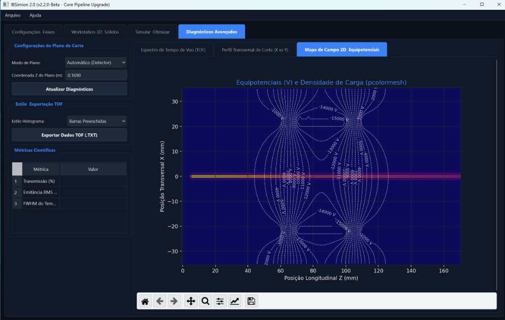
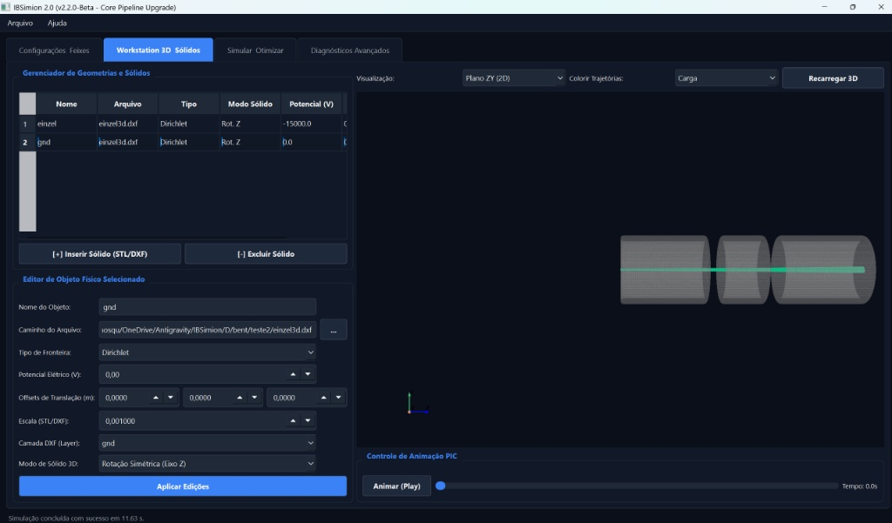
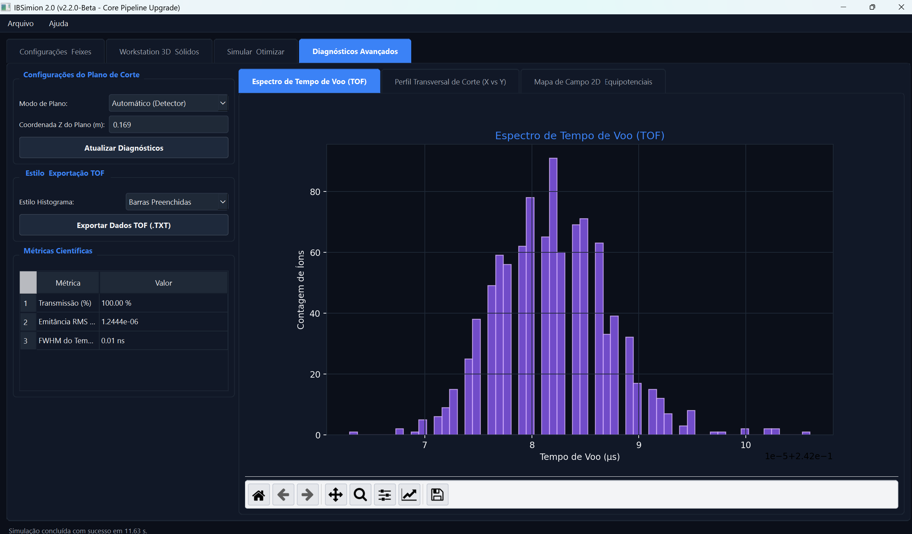
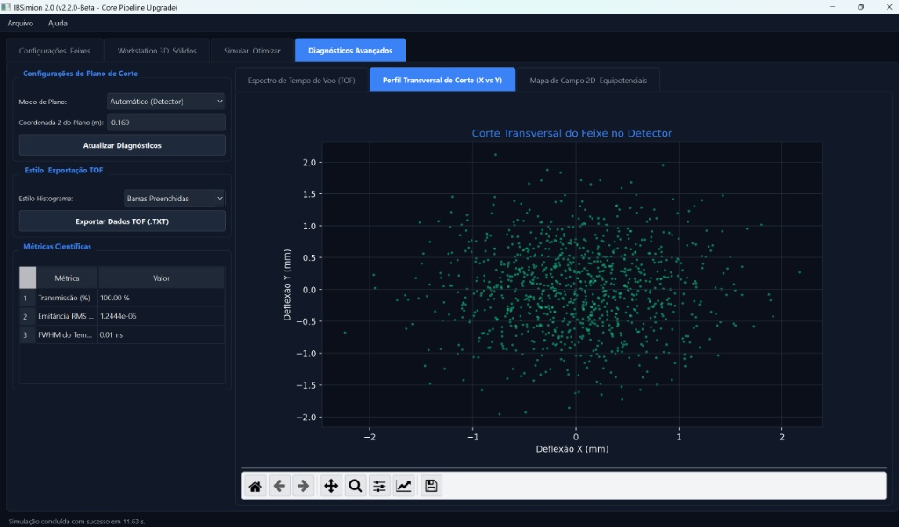

# IBSimion 2.0 — Plataforma de Simulação de Óptica de Partículas / Particle Optics Simulation Platform

---

## 🇧🇷 Português

### 🚀 Sobre o Projeto
O **IBSimion 2.0** é uma interface gráfica generalista de alta performance desenvolvida em PySide6 para o motor de simulação **IBSimu (Ion Beam Simulator)**. A plataforma preenche a lacuna entre resolvedores matemáticos complexos e engenharia aplicada, permitindo projetar, simular e otimizar lentes eletrostáticas, solenóides magnéticos e sistemas de tempo de voo (TOF) diretamente no ecossistema Windows moderno (10/11), utilizando processamento paralelo e renderização tridimensional interativa.

### 💎 Recursos Principais da Aplicação
* **Ingestão CAD em Lote (.DXF):** Importação automática de múltiplas camadas geométricas simultaneamente, mapeando entidades complexas diretamente para potenciais de Dirichlet na malha.
* **Mapeamento Magnético Universal (.TXT):** Leitura algébrica, interpolação spline e escalonamento automático de mapas de campo axial para simulação realista de forças de Lorentz em solenóides.
* **Injeção de Feixe 3D Avançada:** Definição completa de feixes contínuos (CW) ou pulsados utilizando bases ortonormais arbitrárias para controle angular preciso da trajetória espacial e distribuição de corrente.
* **Pipeline de Diagnóstico Automatizado:** Análise em tempo real de matrizes de fase com cálculo de parâmetros Twiss (α, β, ε), gráficos de dispersão e espectrometria fina de Tempo de Voo (TOF).

## 🛠️ Pré-requisitos e Dependências Obrigatórias do Sistema / Mandatory System Prerequisites & Dependencies

#### 🇧🇷 Português
Para que a aplicação funcione corretamente no ecossistema Windows moderno, o ambiente deve ser configurado com os seguintes componentes fundamentais:

1. **Sistema Operacional:** Windows 10 ou 11 (Arquitetura 64-bit).
2. **Dependências Win32 Locais:** Microsoft Visual C++ Redistributable x64 instalado (necessário para a execução estável do Frontend em PySide6).
3. **Subsistema Linux Obrigatório (WSL2):** * Instalação ativa e funcional do **WSL2** com a distribuição **Ubuntu** (ou outra baseada em Debian) devidamente configurada.
   * Compilação interna do motor físico **IBSimu (Ion Beam Simulator)**, obtido via [SourceForge](https://sourceforge.net/projects/ibsimu/), dentro do ambiente Linux do WSL2.
   * O core do resolvedor (`ibsimu_wrapper`) depende diretamente das chamadas de sistema da biblioteca C++ nativa do IBSimu sob a camada ELF64 do Linux para processar as malhas de discretização e resolver a equação de Poisson.

---

## 🇺🇸 English

### 🚀 About the Project
**IBSimion 2.0** is a high-performance, general-purpose graphical user interface developed in PySide6 for the **IBSimu (Ion Beam Simulator)** engine. The platform bridges the gap between complex mathematical solvers and applied engineering, enabling the design, simulation, and optimization of electrostatic lenses, magnetic solenoids, and Time-Of-Flight (TOF) systems directly within a modern Windows environment (10/11), leveraging parallel processing and interactive 3D rendering.

### 💎 Key Features of the Application
* **Batch CAD Ingestion (.DXF):** Automatic importing of multiple geometric layers simultaneously, mapping complex entities directly onto Dirichlet potentials on the mesh.
* **Universal Magnetic Mapping (.TXT):** Algebraic parsing, spline interpolation, and automatic scaling of axial field maps for realistic Lorentz force simulation in solenoids.
* **Advanced 3D Beam Injection:** Full definition of continuous-wave (CW) or pulsed beams utilizing arbitrary orthonormal bases for precise angular trajectory control and current distribution.
* **Automated Diagnostic Pipeline:** Real-time phase-space matrix analysis with Twiss parameter (α, β, ε) calculation, scatter plots, and fine Time-Of-Flight (TOF) spectrometry.

#### 🇺🇸 English
For the application to function correctly within the modern Windows ecosystem, the local environment must be configured with the following fundamental components:

1. **Operating System:** Windows 10 or 11 (64-bit Architecture).
2. **Local Win32 Dependencies:** Microsoft Visual C++ Redistributable x64 installed (required for the stable execution of the PySide6 Frontend).
3. **Mandatory Linux Subsystem (WSL2):** * An active and functional installation of **WSL2** with an **Ubuntu** (or Debian-based) distribution properly configured.
   * Internal compilation of the **IBSimu (Ion Beam Simulator)** physics engine, sourced from [SourceForge](https://sourceforge.net/projects/ibsimu/), inside the WSL2 Linux environment.
   * The solver core (`ibsimu_wrapper`) directly relies on system calls from the native IBSimu C++ library under the Linux ELF64 layer to process discretization meshes and solve the Poisson equation.

---

## 📊 Galeria de Validação Visual / Visual Validation Gallery

| 🇧🇷 Diagnóstico Avançado de Campo 2D / 🇺🇸 Interactive 2D Field Contours | 🇧🇷 Trajetórias 3D Interativas / 🇺🇸 Interactive 3D Trajectories |
|---|---|
|  |  |
| *Escala de potenciais e densidade de carga na malha discretizada.* | *Feixe focalizado de Argônio transpassando o canal da lente.* |

| 🇧🇷 Espectro de Tempo de Voo (TOF) / 🇺🇸 Time-Of-Flight (TOF) Spectrum | 🇺🇸 Transverse Phase Space (X vs Y) / 🇧🇷 Espaço de Fase Transversal |
|---|---|
|  |  |
| *Resolução temporal de partículas coletadas com erro relativo de 0.02%.* | *Distribuição espacial e dispersão angular do feixe no plano do detector.* |

---

## 📜 Licença / License
Este projeto está licenciado sob a Licença MIT. Veja o arquivo LICENSE para detalhes.
This project is licensed under the MIT License. See the LICENSE file for details.
