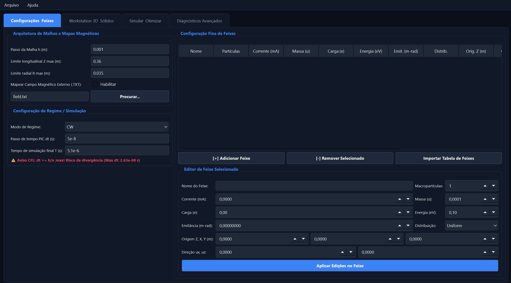
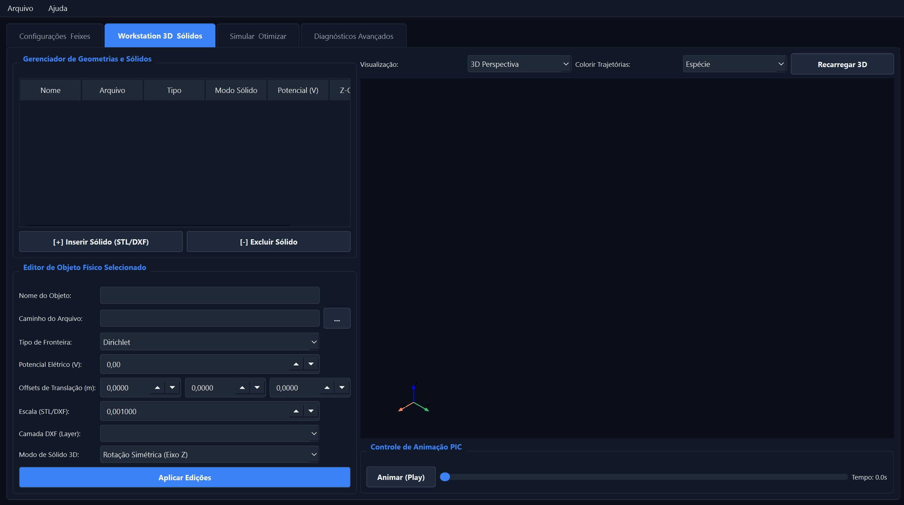
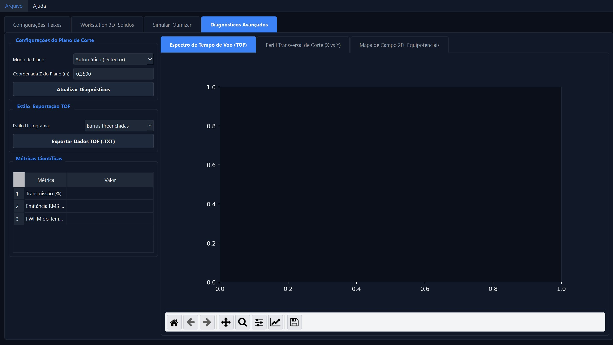

#!/bin/bash
mkdir -p docs
cat << 'EOF' > docs/MANUAL.md
# Manual Prático de Operação — IBSimion 2.0 / Practical Operating Manual — IBSimion 2.0

---

## 🇧🇷 Português
Este manual descreve a functionalidade detalhada de cada campo, botão, parâmetro configurável e comandos dentro do ambiente gráfico do IBSimion 2.0. Ele serve como guia de referência técnica para a configuração de simulações de óptica de íons.

## 🇺🇸 English
This manual describes the detailed functionality of every field, button, configurable parameter, and command within the IBSimion 2.0 graphical user interface. It serves as a technical reference guide for configuring ion optics simulations.

---

## 1. Aba: Configurações Feixes / Tab: Beam Configuration

*Interface de modelagem e inicialização física da malha / Mesh initialization and physical modeling interface.*

### 🔘 Passo da Malha h (m) / Mesh Step h (m)
* **PT:** Define a resolução espacial do resolvedor da equação de Poisson. É o tamanho da célula cúbica elementar da malha tridimensional. Valores menores aumentam drasticamente a precisão da simulação física em regiões críticas de gradiente de campo, ao custo de maior consumo de memória RAM e tempo de processamento.
* **EN:** Defines the spatial resolution for the Poisson equation solver. It represents the elementary cubic cell size of the 3D mesh. Smaller values significantly increase physical simulation accuracy in critical field gradient regions, at the expense of higher RAM consumption and computing time.
* **📝 Exemplo / Example:**
  * 0.001 (1 mm para testes rápidos / 1 mm for fast benchmarking)
  * 0.0002 (0.2 mm para convergência final / 0.2 mm for final physical convergence)

### 🔘 Limite Longitudinal Z max (m) / Longitudinal Limit Z max (m)
* **PT:** Determina a extensão máxima total do eixo óptico principal (Z) da simulação. Estabelece a fronteira de vácuo onde o plano do detector virtual será posicionado para coletar dados de impacto, energia e tempo de voo das partículas.
* **EN:** Determines the total maximum length of the main optical axis (Z) for the simulation. It establishes the vacuum boundary where the virtual detector plane will be positioned to collect particle impact, energy, and time-of-flight data.
* **📝 Exemplo / Example:** 0.50 (500 mm de comprimento do tubo de voo / 500 mm total flight tube length)

### 🔘 Mapear Campo Magnético Externo (.TXT) / Map External Magnetic Field (.TXT)
* **PT:** Caixa de seleção que habilita ou desabilita a superposição de um campo magnético axial gerado por solenóides. Quando ativo, o programa exige um arquivo de texto tabulado contendo as coordenadas Z e os valores de campo Bz correspondentes, calculando os componentes radiais via expansão de série de Taylor para aplicar a força de Lorentz completa.
* **EN:** Checkbox that enables or disables the superposition of an axial magnetic field generated by solenoids. When active, the software requires a tabulated text file containing the Z coordinates and corresponding Bz field values, calculating radial components via Taylor series expansion to apply the complete Lorentz force.
* **📝 Exemplo do Arquivo / File Command Example (potential.txt):**
  | Z_m | Bz_Tesla
  | :---: | :---: |
  0.000 | 0.054
  0.010 | 0.052
  0.020 | 0.048

---

## 2. Aba: Workstation 3D Sólidos / Tab: 3D Solids Workstation

*Manipulação de geometrias CAD e potenciais de eletrodos / CAD geometry manipulation and electrode potentials.*

### 🔘 Botão: Inserir Sólido (STL/DXF) / Button: Insert Solid (STL/DXF)
* **PT:** Dispara o interpretador de geometria em lote. Ele escaneia o arquivo CAD selecionado, identifica as primitivas geométricas tridimensionais (ou polilinhas de rotação no DXF) e povoa automaticamente a tabela de eletrodos da interface gráfica de forma limpa.
* **EN:** Triggers the batch geometry parser. It scans the selected CAD file, identifies the 3D geometric primitives (or rotation polylines in the DXF), and automatically populates the electrode table in the graphical interface cleanly.
* **📝 Comando de Execução Interno / Internal Command Line Execution:**
  wsl ./ibsimu_wrapper --import geometry.dxf --mesh 0.001

### 🔘 Potencial Elétrico (V) / Electric Potential (V)
* **PT:** Campo numérico editável associado à linha do eletrodo selecionado na tabela. Especifica a tensão estática em Volts aplicada àquela superfície metálica, atuando diretamente como uma condição de contorno de Dirichlet para o cálculo de campo eletrostático.
* **EN:** Editable numeric field associated with the selected electrode row in the table. Specifies the static voltage in Volts applied to that metallic surface, acting directly as a Dirichlet boundary condition for the electrostatic field calculation.
* **📝 Exemplo / Example:** -5000.0 (Lente extratora/focalizadora em -5 kV / Extraction lens set at -5 kV)

### 🔘 Seletor: Colorir Trajetórias / Selector: Color Trajectories
* **PT:** Menu suspenso que altera o mapeamento de cores escalar da biblioteca de renderização PyVista. Permite que o feixe tridimensional exiba cores gradientes baseadas em quatro variáveis físicas em tempo real: Massa, Carga, Energia Cinética Atual ou Corrente do Macrofeixe, facilitando análises visuais de perdas e filtragens.
* **EN:** Drop-down menu that alters the scalar color mapping of the PyVista rendering library. It allows the 3D beam to display real-time gradient colors based on four physical variables: Mass, Charge, Current Kinetic Energy, or Macrobeam Current, facilitating visual analysis of filtering and losses.
* **📝 Opções do Menu / Menu Options:** [Mass | Charge | Kinetic Energy | Current]

---

## 3. Aba: Diagnósticos Avançados / Tab: Advanced Diagnostics

*Análise espectrométrica e espaços de fase de emitância / Spectrometric analysis and emittance phase spaces.*

### 🔘 Coordenada Z do Plano (m) / Plane Z Coordinate (m)
* **PT:** Campo reativo que define a posição exata da fatia do espaço onde a matriz de transferência e o espaço de fase transverso serão calculados. Por padrão, ele se autoconfigura na vizinhança do final da malha (Z_max - h) para atuar como o plano do detector.
* **EN:** Reactive field that defines the exact position of the spatial slice where the transfer matrix and transverse phase space will be computed. By default, it auto-configures near the end of the mesh (Z_max - h) to act as the detector plane.
* **📝 Exemplo / Example:** 0.499 (Fatia milimétrica imediatamente anterior ao plano físico final / Millimetric slice right before the end plane)

### 🔘 Botão: Atualizar Diagnósticos / Button: Update Diagnostics
* **PT:** Executa a leitura em disco dos arquivos temporários de saída (tof.txt, trajectories.txt) gerados pelo backend compilado no WSL2. Atualiza instantaneamente os gráficos 2D embutidos do Matplotlib (histogramas, elipses de emitância e perfis de feixe) sem a necessidade de reprocessar a equação de Poisson, otimizando o fluxo de pós-processamento.
* **EN:** Reads the temporary output files (tof.txt, trajectories.txt) generated on disk by the compiled backend in WSL2. Instantly updates the embedded Matplotlib 2D plots (histograms, emittance ellipses, and beam profiles) without needing to re-run the Poisson equation solver, optimizing the post-processing workflow.
* **📝 Arquivos de Entrada Associados / Associated Input Logs:** C:\Users\mosqu\OneDrive\Antigravity\IBSimion\trajectories.txt
EOF